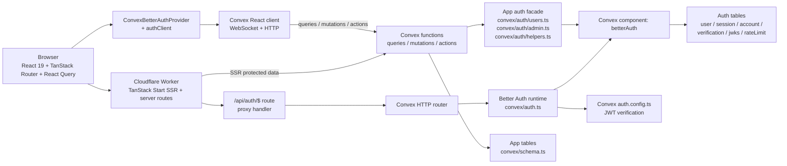
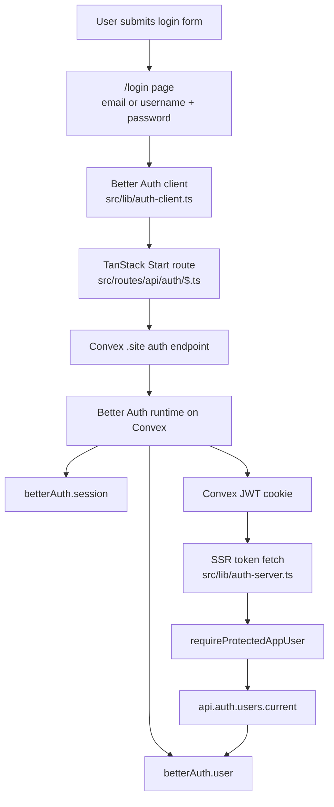

# Architecture

## Runtime architecture

## Login and auth flow

## Notes

- App data and auth data live in the same Convex deployment.
- App tables are defined in `convex/schema.ts`.
- Better Auth tables are isolated inside the `betterAuth` Convex component in `convex/betterAuth/schema.ts`.
- Cloudflare Workers handle SSR and proxy `/api/auth/$`; Better Auth itself runs on Convex.
